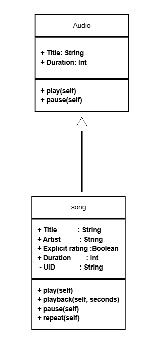
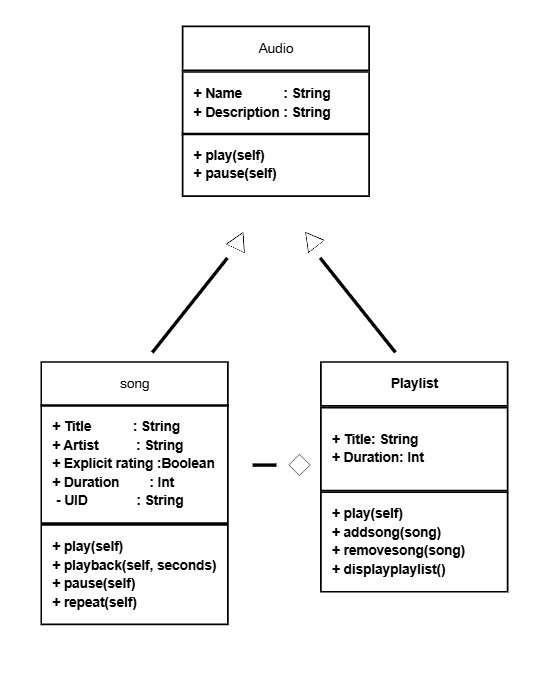
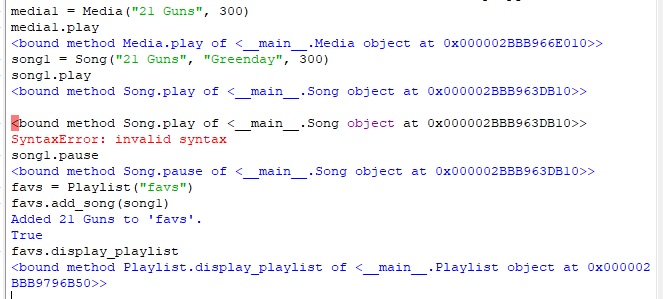
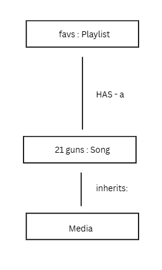

# Advanced Class Relationships
## Previous Activities
[classAttrib](classAttributesMethods.md)
[classRel](classRelationships.md)
## Existing System Description:
## Inheritance Relationship
* Parent: Audio
* Child: Song
* Explanation: A song is a type of audio file.
## Inheritance UML

## Composition/Aggregation
* Relationship: Aggregation (a weak HAS-a relationship)
* Explanation: The playlist class contains songs 
## Advanced UML Diagram

## Python Implementation
[Source Code](advancedRelationships.py)
## Test Run

## Object Diagram

## Reflection
Answers:
1. Because the parent class "media" can allow me to add more related child classes such as "movies" or "books" to expand my system in the future. The child class "song' has and inheritance relationship with the parent class "media" because a song is a type of media.
2. Inheritance allows the methods of media to be inherited by the song class, such as "play" and "pause".
3. My HAS - a relationship is an aggregation. The class "playlist" contains "songs", however, the songs can exist without the playlist.
4. Association refers to the general connection between objects, however in this activity more specific subsets of association is explore such as inheritance and aggregation.
5. The DRY principle stand for "Dont Repeat Yourself", it serves as a guide for clean and easily editable code. This implementation takes advantage of the DRY principles by practicing establishing relationships like inheritance and aggregation between classes so code is not repeated.

