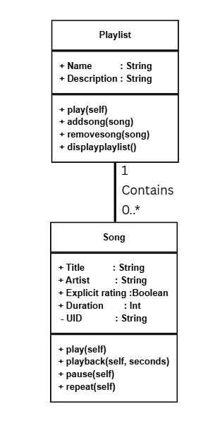
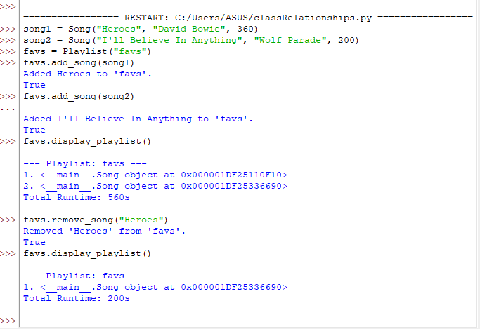
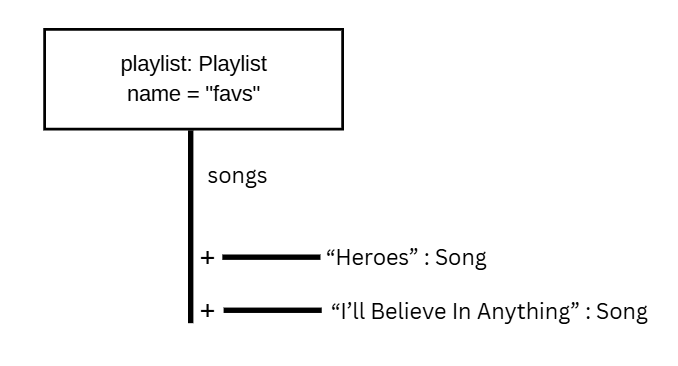

# Class Relationships: Association and Multiplicity
## Previous Work
[Part I - Classes and Objects](classObjectUML.md)
[Part II - Class Attributes and Methods](classAttributesMethods.md)
## Existing Class
Class: Song
Description: Represents a playable song with an artist and title.
## New Related Class
Class: Playlist
Description: A playable collection of songs.
## Association
Relationship: Playlist contains songs.
Explanation: A playlist is a collection of added songs.
## Multiplicity
Multiplicity: Zero or more
Explanation: A playliat can be empty amd hold an infinite amount of songs.
## UML Class Relationship Diagram

## Python Implementation
[View Python Source](classRelationships.py)
## Test Run

## Object Relationship Diagram

## Analysis
### What is the association between your two classes? 
  The class playlist can contain the class songs.
### What multiplicity did you choose and why?
 Zero or more, because a playlist should be able to contain an infinite amount of songs or be empty.
### How did you implement the relationship in Python?
  By instantiating a child object outside the parent class and passing it in as an argument. 
### Why did you store an object reference instead of copying its data?
 Object reference is automatically stored when an object is assigned to a variable. When two variables point at the same object, change in 1 variable updates data values for both, this allows code to experience updates without needing to constantly pass data.
 ### If your relationship uses many, why is a list appropriate?
  Because a single object needs to store multiple reference to other independent objects. Since the objects in the list exist independently, they can exist on their own even when the list or the main object is destroyed.
