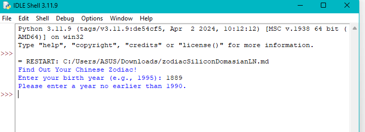

def chinese_zodiac(year):
    # List of zodiacs
    zodiac = ["Monkey (猴 / Hóu)", "Rooster (鸡 / Jī)", "Dog (狗 / Gǒu)", "Pig (猪 / Zhū)", "Rat (鼠 / Shǔ)", "Ox (牛 / Niú)", "Tiger (虎 / Hǔ)", "Rabbit (兔 / Tù)", "Dragon (龙 / Lóng)", "Snake  (蛇 / Shé)", "Horse (马 / Mǎ)",
              "Goat (羊 / Yá)"]
    
    # Calculate indices using the modulo operator
    zodiac_index = year % 12
    
    return zodiac[zodiac_index]

def main():
    print("Find Out Your Chinese Zodiac! ")
    try:
        birth_year = int(input("Enter your birth year (e.g., 1995): "))
        
        if birth_year < 1990:
            print("Please enter a year no earlier than 1990.")
            return
            
        zodiac = chinese_zodiac(birth_year)
        print(f"\nYour Chinese Zodiac is the {zodiac}.")
    
        
    except ValueError:
        print("Invalid input! Please enter a numerical year.")

if __name__ == "__main__":
    main()

#Documentation

